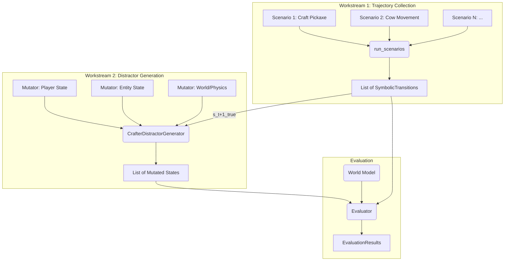

# PRD: Hybrid Evaluation Framework for Crafter (Revised Architecture)

## 1. Motivation / Background

This document outlines the engineering requirements for extending our hybrid evaluation framework to the Crafter environment. This revised version incorporates a cleaner, more functional architecture for trajectory collection and provides a detailed specification for the distractor generation mechanism, which is the next major implementation step.

The primary goal is to create a robust, configurable, and maintainable testing suite for Crafter world models. This involves two key workstreams:
1.  **Trajectory Collection**: Implementing flexible, scenario-based strategies for collecting interesting and diverse state transitions from the environment.
2.  **Distractor Generation**: Creating a structured and categorized set of state "mutators" to test a world model's fine-grained understanding of game mechanics.

**Reference Document:** [Hybrid Evaluation Framework for Symbolic WMs](docs/1-hybrid-evaluation-framework-for-symbolic-wms.md)

## 2. Executive Summary

The evaluation framework for Crafter will be composed of two main components, following the hexagonal architecture defined in `src/distant_sunburn/evaluator/core.py`.

1.  **Trajectory Collection**: We will use a scenario-driven approach. Each `Scenario` is a self-contained unit that defines an initial state, a policy to execute, and a goal condition. A runner function, `run_scenarios`, will execute these scenarios to generate a dataset of `SymbolicTransition` objects. This approach provides a highly structured and reproducible way to collect data that targets specific game mechanics.

2.  **Distractor Generation**: A `CrafterDistractorGenerator` will be implemented. This component will take a ground-truth `SymbolicTransition` and produce a set of "distractors"—plausible but incorrect next-states. It will do this by applying a series of fine-grained `Mutator` functions to the true next-state. These mutators are categorized by the type of game rule they violate (e.g., Player State, Entity AI, Physics), allowing for detailed analysis of a world model's strengths and weaknesses.



## 3. Workstream 1: Trajectory Collection

The trajectory collection process is driven by `Scenario` objects, which are stateless descriptions of a specific task or behavior to be tested. This design ensures that tests are isolated, reproducible, and easy to author.

### 3.1. The `Scenario` Protocol

All scenarios adhere to a common interface defined in `src/distant_sunburn/evaluator/crafter/scenarios.py`.

```python
# In: src/distant_sunburn/evaluator/crafter/scenarios.py

class Scenario(Protocol):
    @property
    def name(self) -> str: ...

    def get_initial_state(self) -> WorldState:
        """Creates and returns the specific starting WorldState for this scenario."""
        ...

    def policy(self, state: WorldState) -> ActionT:
        """Returns the action to take at the given state."""
        ...

    @property
    def max_steps(self) -> int:
        """Returns the maximum number of steps to take in the scenario."""
        ...

    def goal_test(self, transitions: list[SymbolicTransition[WorldState]]) -> GoalChecked:
        """Returns True if the scenario has been achieved."""
        ...
```

### 3.2. Scenario Execution

Scenarios are executed by the `run_scenarios` function. It takes a list of `Scenario` objects, runs each one until its `goal_test` returns `True` or `max_steps` is reached, and collects all the `SymbolicTransition` objects generated along the way.

```python
# In: src/distant_sunburn/evaluator/crafter/scenarios.py

def run_scenarios(scenarios: list[Scenario]) -> list[ScenarioRunResult]:
    # ... implementation details ...
```

This function serves as the entry point for generating the evaluation dataset.

## 4. Workstream 2: Distractor Generation

The core of the fine-grained evaluation lies in the generation of high-quality distractors. We will implement a `CrafterDistractorGenerator` that uses a library of "mutators" to create these distractors.

### 4.1. Architecture

The `CrafterDistractorGenerator` will implement the `DistractorGenerator` protocol from `src/distant_sunburn/evaluator/core.py`. Its primary responsibility is to manage a collection of mutators and use them to generate distractors. A key feature of this design is the use of **preconditions** within mutators, allowing them to be applied only to relevant game states.

When called, the generator will:
1.  Receive a ground-truth `transition`.
2.  Repeatedly sample mutators from its library.
3.  For each sampled mutator, check if its `precondition` is met by the transition.
4.  If the precondition passes, apply the mutation to a deep copy of the `transition.next_metadata`.
5.  Collect `num_distractors` successfully generated states and return them.

### 4.2. Mutator Categories

Mutators will be grouped to test specific aspects of the world model's knowledge. This categorization is critical for producing an interpretable report of model performance.

*   **Player State Mutations:** Test rules related to the player's status, inventory, and position.
*   **Entity State Mutations:** Test rules related to non-player characters (NPCs) like cows, zombies, and skeletons.
*   **World & Terrain Mutations:** Test rules about the static environment and its objects.
*   **Physics & Rule Violations:** Test the model's understanding of fundamental game logic and causality.

### 4.3. Example Mutator Implementations

All mutators will be implemented as simple, self-contained callables. They should be stateless and operate on a *copy* of the state.

#### Example 1: Simple Inventory Mutation

```python
# In: src/distant_sunburn/evaluator/crafter/mutators.py

import copy
from crafter.state_export import WorldState
from crafter.constants import ActionT

class AddIllegalItemMutator:
    """
    A mutator that adds an item to the player's inventory that
    should not be there. This tests if the world model understands
    inventory causality.
    """
    
    def __init__(self, item_name: str, amount: int):
        self.item_name = item_name
        self.amount = amount
        self.category = "Player State"

    def precondition(self, action: ActionT, state: WorldState) -> bool:
        # This mutator is general and can apply to any action.
        return True

    def __call__(self, state: WorldState) -> WorldState:
        mutated_state = copy.deepcopy(state)
        current_amount = getattr(mutated_state.player.inventory, self.item_name)
        setattr(
            mutated_state.player.inventory, 
            self.item_name, 
            current_amount + self.amount
        )
        return mutated_state
```

#### Example 2: Complex Entity Movement Mutation with Precondition

This mutator moves an entity to an illegal tile (e.g., a wall), testing the model's understanding of collision physics.

```python
# In: src/distant_sunburn/evaluator/crafter/mutators.py

import copy
import random
from crafter.state_export import WorldState, CowState, Position
from crafter.constants import ActionT
from .utils import find_all_objects_for_type, find_object_in_state

class TeleportEntityToIllegalTileMutator:
    """
    Moves a random cow to a non-walkable tile, violating physics.
    """
    def __init__(self, seed: int):
        self.rng = random.Random(seed)
        self.category = "Entity State"

    def precondition(self, action: ActionT, state: WorldState) -> bool:
        # This mutator is only interesting if a cow exists and there is a non-walkable tile.
        if not find_all_objects_for_type(state, CowState):
            return False
        
        # Find at least one non-walkable tile
        for x in range(state.size[0]):
            for y in range(state.size[1]):
                material, _ = state.get_tile(Position(x=x, y=y))
                if material not in {'grass', 'path', 'sand', 'water', 'lava'}:
                    return True
        return False

    def __call__(self, state: WorldState) -> WorldState:
        mutated_state = copy.deepcopy(state)
        
        # Find a cow
        cows = find_all_objects_for_type(mutated_state, CowState)
        target_cow = self.rng.choice(cows)

        # Find an illegal tile
        illegal_tiles = []
        for x in range(mutated_state.size[0]):
            for y in range(mutated_state.size[1]):
                material, occupant = mutated_state.get_tile(Position(x=x, y=y))
                if material not in {'grass', 'path', 'sand', 'water', 'lava'} and occupant is None:
                    illegal_tiles.append(Position(x=x, y=y))
        
        if not illegal_tiles:
            # Should not happen if precondition is checked
            return state 

        # Move the cow
        new_pos = self.rng.choice(illegal_tiles)
        cow_in_state = find_object_in_state(mutated_state, target_cow.entity_id, CowState)
        if cow_in_state:
            cow_in_state.position = new_pos
            
        return mutated_state
```

### 4.4. Testing Mutators

Tests for mutators are essential but should be simple. The goal is not to test the game's logic, but to verify that the mutator correctly applies its intended, specific modification to the state without errors.

**Guidelines for testing mutators:**
1.  **Arrange:** Create a minimal `WorldState` that satisfies the mutator's precondition. Use helper functions to construct this state.
2.  **Act:** Instantiate and call the mutator with the arranged state.
3.  **Assert:**
    *   Verify that the specific, intended change was made (e.g., the cow's position is now the new, illegal position).
    *   Verify that the original state object was not modified.
    *   Optionally, verify that other parts of the state remain unchanged by comparing a hash or specific fields.

```python
# In: tests/balrog/test_mutators.py

from src.distant_sunburn.evaluator.crafter.mutators import TeleportEntityToIllegalTileMutator
from crafter.state_export import WorldState, CowState, Position
# ... (import test helpers for creating a world state)

def test_teleport_entity_mutator():
    # 1. Arrange: Create a state with a cow and a stone wall
    initial_state = create_test_state_with_cow_and_wall()
    cow = find_all_objects_for_type(initial_state, CowState)[0]
    original_cow_pos = cow.position
    wall_pos = Position(x=0, y=0) # Assume wall is at (0,0)

    # 2. Act
    mutator = TeleportEntityToIllegalTileMutator(seed=42)
    
    # Ensure precondition passes
    assert mutator.precondition("noop", initial_state)
    
    mutated_state = mutator(initial_state)

    # 3. Assert
    # Find the cow in the new state
    mutated_cow = find_object_in_state(mutated_state, cow.entity_id, CowState)
    assert mutated_cow is not None
    
    # Assert the cow has moved to an illegal tile (the test can be more specific)
    assert mutated_cow.position != original_cow_pos
    material, _ = mutated_state.get_tile(mutated_cow.position)
    assert material == 'stone'

    # Assert original state is unchanged
    original_cow_still_in_place = find_object_in_state(initial_state, cow.entity_id, CowState)
    assert original_cow_still_in_place.position == original_cow_pos
```

### 4.5. Future Work: Scenarios and Mutators

To provide comprehensive coverage of Crafter's mechanics, we should continue to expand our library of scenarios and mutators in tandem.

#### Potential Future Scenarios:
*   **`MineResourceScenario`**: Player must find and mine a specific resource (e.g., stone, coal), requiring the correct tool.
*   **`CombatScenario`**: Player must defeat a specific enemy (e.g., a zombie or skeleton).
*   **`BuildStructureScenario`**: Player must gather resources and place them to build a simple structure.
*   **`SurviveNightScenario`**: Player must survive for a full day-night cycle, managing hunger, thirst, and potential mob attacks.

#### Potential Future Mutators (linked to scenarios):
*   **`ViolateToolRequirementMutator`**: Allows the player to successfully mine stone without a pickaxe. (Tests knowledge from `MineResourceScenario`).
*   **`IncorrectDamageMutator`**: Causes a sword attack to deal the wrong amount of damage. (Tests knowledge from `CombatScenario`).
*   **`IgnoreCooldownMutator`**: Allows a zombie to attack on consecutive ticks, ignoring its cooldown. (Tests knowledge from `CombatScenario`).
*   **`IgnorePlacementRulesMutator`**: Allows the player to place an object on an invalid tile type (e.g., a table on lava). (Tests knowledge from `BuildStructureScenario`).
*   **`StatUpdateErrorMutator`**: Prevents hunger or thirst from decreasing when the player eats or drinks. (Tests knowledge from `SurviveNightScenario`).

## 5. Factory and Final Assembly

The factory will be responsible for assembling the final `EvaluationContext` using the components described above.

```python
# In: src/distant_sunburn/evaluator/crafter/factory.py

from .components import CrafterDistractorGenerator, JSONPatchEditDistance
from .scenarios import run_scenarios, CraftWoodenPickaxeScenario, CowMovementScenario
from ..core import EvaluationContext, EvaluationConfig
from crafter.state_export import WorldState

class CrafterEvaluationFactory:
    def create_context(
        self, config: EvaluationConfig, num_transitions_per_scenario: int
    ) -> EvaluationContext[WorldState]:

        # 1. Define and run scenarios to collect trajectories
        scenarios = [
            CraftWoodenPickaxeScenario(), 
            CowMovementScenario(max_steps=num_transitions_per_scenario)
        ]
        scenario_results = run_scenarios(scenarios)
        
        test_transitions = []
        for result in scenario_results:
            test_transitions.extend(result.transitions)

        # 2. Instantiate the distractor generator with all mutators
        distractor_generator = CrafterDistractorGenerator(seed=42)

        # 3. Assemble the context
        return EvaluationContext(
            config=config,
            test_transitions=test_transitions,
            distractor_generator=distractor_generator,
            edit_distance_calculator=JSONPatchEditDistance(),
        )
```

## 6. Acceptance Criteria & Implementation Plan

1.  **Create Mutator Infrastructure:**
    *   Create `src/distant_sunburn/evaluator/crafter/mutators.py`.
    *   Implement the `CrafterDistractorGenerator` class in `src/distant_sunburn/evaluator/crafter/components.py`. It should be able to register, check preconditions, and sample mutators.
2.  **Implement Initial Set of Mutators:**
    *   Implement `AddIllegalItemMutator` and `TeleportEntityToIllegalTileMutator`.
    *   **Verifiable Outcome:** A unit test for each mutator (as described in Sec 4.4) passes.
3.  **Integrate into Factory:**
    *   Update `CrafterEvaluationFactory` to instantiate and inject the `CrafterDistractorGenerator`.
4.  **End-to-End Test:**
    *   Create a test in `tests/evaluator/test_crafter_scenarios.py` that constructs a full `EvaluationContext` and runs a mock `EvaluatableWorldModel` against it.
    *   **Verifiable Outcome:** The test successfully completes an evaluation run and produces an `EvaluationResults` object, demonstrating that all components are correctly integrated.

## 7. Appendix: Detailed Scenario Implementation Guide
This guide demonstrates creating a scenario with the clean, functional architecture.

### Step 1 & 2: Define Goal and Pre-conditions (Unchanged)
- **Goal:** Test crafting a wooden pickaxe.
- **Pre-conditions:** Player needs 2 wood, must be next to a table.

### Step 3: Code the Scenario

The scenario encapsulates its own setup logic, creating the desired starting state from scratch. This improves testability and isolation.

```python
# In: src/distant_sunburn/evaluator/crafter/scenarios.py

from crafter.functional_env import (
    reconstruct_world_from_state,
    export_world_state,
    initial_state,
)
from crafter.state_export import WorldState
from crafter.constants import ActionT
from .utils import find_player
from crafter.testing_helpers import (
    player_utils,
    world_utils,
)

class CraftWoodenPickaxeScenario(Scenario):
    @property
    def name(self) -> str:
        return "craft_wooden_pickaxe"

    def get_initial_state(self) -> WorldState:
        view = (9, 9)
        state = initial_state(area=(9, 9), view=view, seed=1)
        world = reconstruct_world_from_state(state)

        player = find_player(world)
        player_utils.set_player_position(player, (5, 5))
        player_utils.set_player_facing(player, (0, 1))
        world_utils.set_tile_material(world, (5, 6), "table")
        player_utils.set_player_inventory_item(player, "wood", 2)
        player_utils.set_player_inventory_item(player, "wood_pickaxe", 0)

        return export_world_state(world, view=view, step_count=0)

    def policy(self, state: WorldState) -> ActionT:
        return "make_wood_pickaxe"
    
    @property
    def max_steps(self) -> int:
        return 1

    def goal_test(self, transitions: list[SymbolicTransition[WorldState]]) -> GoalChecked:
        final_state = transitions[-1].next_metadata
        return GoalChecked(final_state.player.inventory.wood_pickaxe > 0)

```

## 8. Changelog
- **2025-08-24:** Added a more complex mutator example (`TeleportEntityToIllegalTileMutator`), introduced the concept of mutator preconditions, added a section on testing mutators with an example, and included a future work section for new scenarios and mutators.
- **2025-08-24:** Revised PRD to reflect the implemented scenario-based trajectory collection. Added a detailed design and implementation plan for the `CrafterDistractorGenerator` and its categorized mutators.
- **2025-08-24:** Updated PRD to reflect the implemented functional approach for scenario creation. `Scenario.get_initial_state` is now stateless, and the implementation guide uses `initial_state` and `reconstruct_world_from_state` instead of a temporary `Env` object. Trajectory collection strategies updated to convert action strings to indices before calling `transition`.
